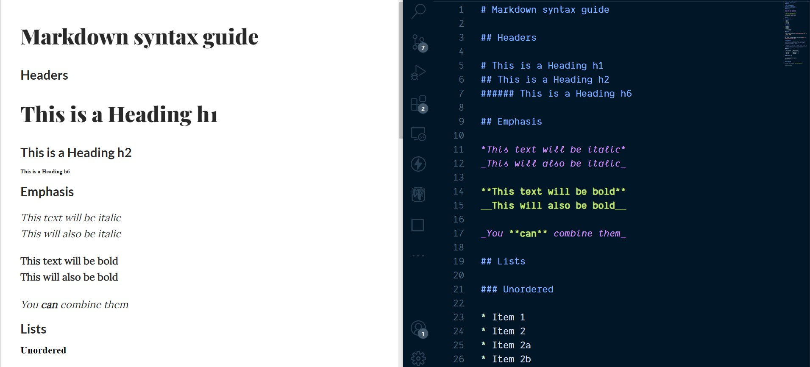

# MarkDown to HTML

A simple compiler that converts markdown files to html.



## Usage

- create folder `markdowns` in root directory.
- create file `index.md` inside `markdowns`
- add following content for testing

```md
# Heading
## Heading 1
### Heading 3

**bold**
> quote
`code`
```

- install dependencies `npx yarn`
- run application `npx yarn dev`
- install `live server` extension in VS code and open html file (inside public folder) with live server.

